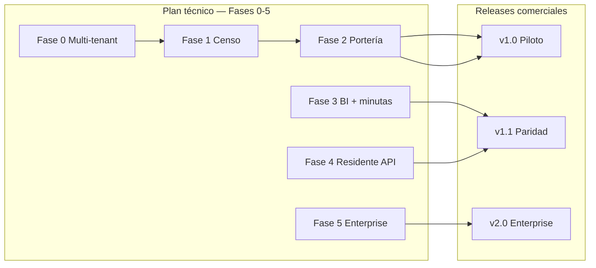

# Estrategia de versiones y alcance — Controla

> **Propósito:** Definir qué entra en cada **release comercial**, cómo se relaciona con las **fases técnicas** del plan, y reemplazar la ambigüedad de “OMITIR v1”.  
> **Versión:** 1.0  
> **Fecha:** 2026-07-11  
> **Estado:** Aprobado para ejecución  
> **Relacionado:** [PLAN-INICIO-PROYECTO-CONTROLA.md](./PLAN-INICIO-PROYECTO-CONTROLA.md) · [ESTANDARES-IMPLEMENTACION-SENIOR.md](./ESTANDARES-IMPLEMENTACION-SENIOR.md) · [REFERENCIA-PLATAFORMA-CONTROL-ACCESOS.md](./REFERENCIA-PLATAFORMA-CONTROL-ACCESOS.md) Anexo C.12

---

## 1. Decisión de producto (resumen ejecutivo)

| Pregunta | Decisión |
|----------|----------|
| ¿Esperamos todas las fases (0–5) para sacar v1? | **No** — riesgo de mercado y retrabajo |
| ¿Sacamos un v1 “básico” y mejoramos después? | **No** — todo release cumple [DoD senior](./ESTANDARES-IMPLEMENTACION-SENIOR.md) |
| ¿Qué es v1.0 comercial? | **Piloto vendible:** multi-tenant + censo + portería Fase 2 completa |
| ¿Qué pasa con white label, RFID, PH contable, antecedentes? | **Planificados en v1.1 / v2.0 enterprise**, no cancelados |
| ¿Calidad mínima? | **Senior en cada módulo entregado**, desde este momento |

### Frase guía

> **Controla v1.0 no es lo mínimo que compila; es lo mínimo que una empresa de seguridad opera un conjunto real sin Excel — con arquitectura de producto largo plazo.**

---

## 2. Tres planos de planificación

| Plano | Documento | Uso |
|-------|-----------|-----|
| **Fases 0–5** | [PLAN-INICIO-PROYECTO-CONTROLA.md](./PLAN-INICIO-PROYECTO-CONTROLA.md) | Orden de construcción técnica |
| **Releases v1.x** | Este documento | Qué promete el producto al cliente |
| **Referencia Axesa** | [REFERENCIA-PLATAFORMA-CONTROL-ACCESOS.md](./REFERENCIA-PLATAFORMA-CONTROL-ACCESOS.md) | Paridad funcional y checklist C.12 |

---

## 3. Releases comerciales

### v1.0 — Piloto operativo (tag objetivo: `v1.0.0`)

**Cuándo:** Fase 2 completada con DoD senior.  
**Para quién:** Primera empresa de seguridad + ≥1 conjunto en producción staging/piloto.

| Incluye | Rutas / artefactos |
|---------|-------------------|
| Multi-tenant 3 niveles | `/admin`, `/company`, scoping global |
| Censo unificado | `/client/*`, `structures`, members, vehicles, authorizations |
| Portería operativa | `/access/*` hub ingresos/salidas, personas adentro, correspondencia |
| Sidebar accesos rápidos | Layout portería |
| Landing + login marca | `/`, `/login` AuthLayout |
| Datos demo + manual guarda | Seeders, doc operativa 1 pág. |

**Definition of Done v1.0 (negocio):**

- [ ] Empresa crea ≥2 clientes desde panel (sin Excel).
- [ ] Censo completo en ≥1 cliente (estructuras + personas + vehículos).
- [ ] Guarda registra ingreso/egreso peatón y vehículo en **< 45 s** (UX test).
- [ ] Personas adentro en tiempo real; salida masiva de turno.
- [ ] **0** incidentes cross-tenant en tests + revisión manual.
- [ ] 1 semana de operación piloto sin hoja paralela.

**KPIs post-lanzamiento v1.0 (6 meses):** ver Plan §10.1.

---

### v1.1 — Paridad operativa Axesa (tag objetivo: `v1.1.0`)

**Cuándo:** Fases 3 + 4 completadas con DoD senior.

| Incluye | Referencia |
|---------|------------|
| BI: horas pico, distribución estructura, matriz visitantes | Plan Fase 3, Ref §3 |
| Minutas geo + firma supervisor | Plan Fase 3, Ref §4 |
| Portal / API residente | Plan Fase 4 |
| Pre-autorizaciones E2E residente → portería | Anexo C.12 |
| Push correspondencia (mínimo) | Anexo C.5.3 |
| Usuarios APP `@login_suffix` operativos | Ref §1.2.6 |

**Gate:** Checklist [Anexo C.12](./REFERENCIA-PLATAFORMA-CONTROL-ACCESOS.md) completo.

---

### v2.0 — Enterprise (tag objetivo: `v2.0.0`)

**Cuándo:** Fase 5 + módulos antes etiquetados “OMITIR v1”, cada uno con DoD senior propio.

| Módulo | Prioridad sugerida | Notas |
|--------|-------------------|-------|
| White label por cliente | P0 enterprise | Branding, dominio, emails/PDF |
| Integración hardware RFID / LPR / huella | P1 | Adapters + fallback manual |
| Parqueaderos visitantes + recaudo | P1 | Módulo parking acotado |
| Listas negras + antecedentes (Policía/Procuraduría) | P1 | Legal, auditoría, async |
| PH avanzado (circulares, presupuesto, facturas) | P2 | Bounded context `PropertyAdmin` o integración Properix |
| PQRS / zonas comunes avanzadas | P2 | Si no cubierto en v1.1 |

**Posicionamiento v2.0:** superar Axesa en operación **y** capacidades enterprise; no competir con Properix en contabilidad profunda sin acuerdo comercial explícito.

---

## 4. Reinterpretación de “OMITIR v1” (Anexo C.7)

Lo que el documento de referencia llamaba **OMITIR v1** pasa a llamarse **POSTPONER release**, con destino explícito:

| Ítem (Anexo C.7) | Antes | Ahora |
|------------------|-------|-------|
| PH contable completa | OMITIR v1 | **v2.0** — `PropertyAdmin` o integración |
| White label | OMITIR v1 | **v2.0** — P0 enterprise |
| Hardware RFID/LPR/huella | OMITIR v1 | **v2.0** — adapters |
| Antecedentes Policía/Procuraduría | OMITIR v1 | **v2.0** — módulo regulado |
| Producto Buo (pánico separado) | OMITIR | **Integrado** en v1.1 portal/API |

**ADOPTAR / DIFERENCIAR / MEJORAR** del Anexo C.7 **siguen vigentes**; solo cambia el **calendario de release**, no la ambición.

---

## 5. Estado actual vs. próximo hito (2026-07-11)

| Área | Estado | Release |
|------|--------|---------|
| Fase 0 Multi-tenant | ✅ Implementada | Base v1.0 |
| Fase 1 Censo | ✅ Implementada | Base v1.0 |
| Landing + Auth | ✅ Implementada | Base v1.0 |
| Fase 2 Portería | ⏳ Pendiente | **Bloquea v1.0** |
| Fase 3 BI + minutas | ⏳ Pendiente | v1.1 |
| Fase 4 Residente | ⏳ Pendiente | v1.1 |
| Fase 5 Enterprise | ⏳ Pendiente | v2.0 |

**Próximo foco único:** cerrar **Fase 2** al estándar senior → declarar **v1.0.0** → piloto con empresa de seguridad.

---

## 6. Gates de aprobación (sin cambios de espíritu al plan original)

Antes de taggear un release:

1. **DoD senior** cumplido ([checklist](./ESTANDARES-IMPLEMENTACION-SENIOR.md)).
2. **DoD de release** de este documento (§3) cumplido.
3. **DoD de fase** del [Plan](./PLAN-INICIO-PROYECTO-CONTROLA.md) cumplido para las fases incluidas.
4. Demo grabada + OK explícito product owner.
5. Tests en `controla_test` verdes para suites del módulo.

---

## 7. Tags Git sugeridos

| Tag | Contenido |
|-----|-----------|
| `v0.1.0` | Fase 0 (histórico / ya superado) |
| `v0.2.0` | Fase 1 (histórico / ya superado) |
| `v0.3.0` | Pre-v1: landing + auth + estabilización |
| **`v1.0.0`** | **Piloto operativo — Fase 2** |
| `v1.1.0` | Paridad Axesa — Fases 3–4 |
| `v2.0.0` | Enterprise — Fase 5 |

---

## 8. Qué NO hacer

- No acumular fases 2–5 para un único “big bang” v1.
- No etiquetar “hecho” módulos sin DoD senior.
- No implementar PH contable dentro de `/access` o `/client/structures`.
- No prometer v2.0 enterprise en contrato mientras v1.0 no esté en piloto estable.

---

## 9. Registro de cambios

| Versión | Fecha | Cambios |
|---------|-------|---------|
| 1.0 | 2026-07-11 | Estrategia v1.0 / v1.1 / v2.0, reinterpretación OMITIR v1, gates y tags |

---

*Documento vivo. Actualizar al cerrar cada release.*
