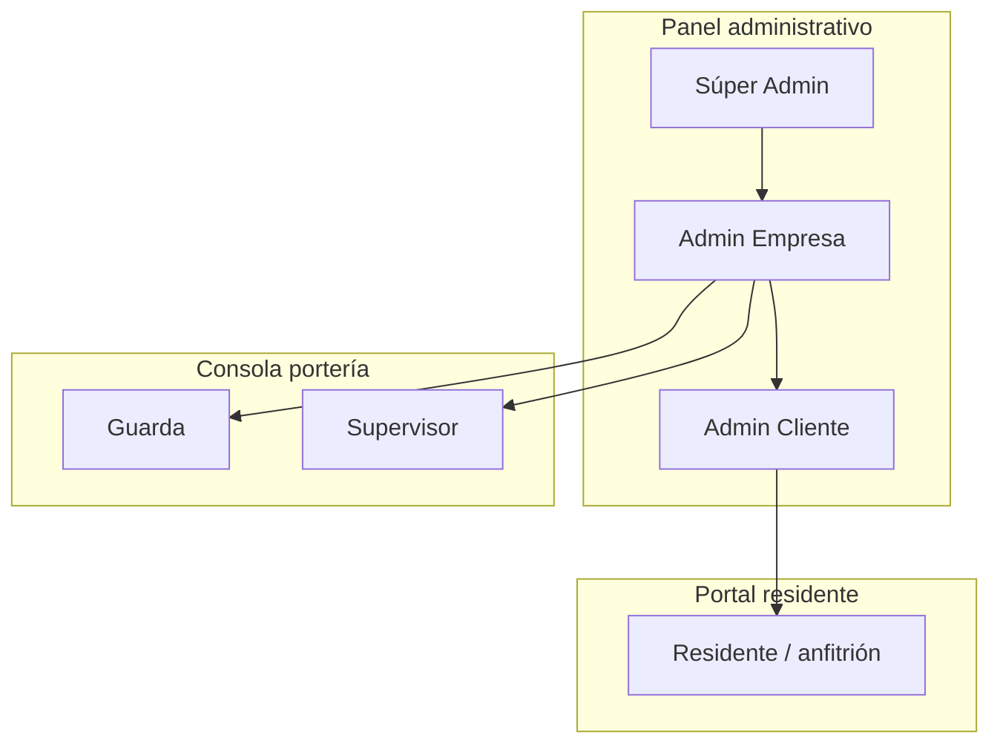
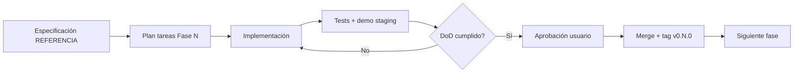

# Plan de Inicio — Proyecto Controla

> **Propósito:** Hoja de ruta ejecutable para pasar de documentación (referencia Axesa / Creawilder) a implementación incremental en Controla.  
> **Versión:** 1.0  
> **Fecha:** 2026-07-07  
> **Estado:** Aprobación pendiente por fase — **no iniciar código de una fase sin firmar su Definition of Done**  
> **Calidad y releases:** [ESTANDARES-IMPLEMENTACION-SENIOR.md](./ESTANDARES-IMPLEMENTACION-SENIOR.md) · [ESTRATEGIA-VERSIONES-Y-ALCANCE.md](./ESTRATEGIA-VERSIONES-Y-ALCANCE.md) (v1.0 / v1.1 / v2.0 — todo entregable nivel senior)

---

## 1. Resumen ejecutivo

**Controla** es una plataforma SaaS B2B de control de accesos y vigilancia para empresas de seguridad privada y conjuntos residenciales en Colombia. Se construye sobre **Laravel 11** en Laragon, tomando como referencia funcional **Axesa Control v13** y superándola en:

1. **Panel Admin Empresa** — gestión centralizada de clientes (sin Excel).
2. **Multi-tenant estricto** — 3 niveles: Súper Admin → Empresa → Cliente.
3. **Stack unificado** — API-first, permisos enforced en backend, arquitectura por capas.

El plan divide el trabajo en **6 fases (0–5)**. La **Fase 0 es bloqueante**: sin multi-tenant y roles correctos, el resto acumula deuda técnica como en Axesa.

**MVP operativo (portería + censo + un cliente piloto):** fin de **Fase 2**.  
**Paridad mínima vs Axesa v13 (checklist Anexo C.12):** fin de **Fase 4**.

---

## 2. Documentación vinculada

| Documento | Uso en este plan |
|-----------|------------------|
| [ESTANDARES-IMPLEMENTACION-SENIOR.md](./ESTANDARES-IMPLEMENTACION-SENIOR.md) | DoD transversal, anti-patrones, checklist PR |
| [ESTRATEGIA-VERSIONES-Y-ALCANCE.md](./ESTRATEGIA-VERSIONES-Y-ALCANCE.md) | v1.0 piloto, v1.1 paridad Axesa, v2.0 enterprise |
| [REFERENCIA-PLATAFORMA-CONTROL-ACCESOS.md](./REFERENCIA-PLATAFORMA-CONTROL-ACCESOS.md) | Especificación funcional, BD, UI de referencia (v1.9) |
| [assets/referencia/01-estructura-por-roles.png](./assets/referencia/01-estructura-por-roles.png) | Matriz roles × módulo Estructura |
| Anexo A (referencia) | Gap analysis Controla actual vs Axesa |
| Anexo C (referencia) | Inteligencia pública, backlog y checklist paridad |

**Regla:** cada ítem implementado debe citar la sección de referencia que lo originó (ej. `§1.2.2 Personas`).

---

## 3. Visión del producto

### 3.1 Propuesta de valor

| Actor | Problema hoy (Axesa) | Solución Controla |
|-------|----------------------|-------------------|
| Empresa de seguridad | Excel + solicitud manual por cada cliente nuevo | Panel único: alta cliente, asignación guardas, métricas |
| Admin conjunto | Censo fragmentado, sin API clara | Módulo Estructura unificado + directorios globales |
| Guarda | UI legacy, sin personas adentro en tiempo real | Consola portería reactiva + sidebar rápido |
| Residente | App separada, login `@cliente` manual | Portal/API scoped a su unidad |

### 3.2 Posicionamiento

> *Axesa en operación portería + panel B2B moderno + Laravel 11.*  
> No competir en v1 con contabilidad PH (Properix); sí en control de accesos + vigilancia.

### 3.3 Tres superficies de producto



| Superficie | Prefijo rutas objetivo | Usuarios |
|------------|------------------------|----------|
| Plataforma | `/admin` | `super-admin` |
| Empresa | `/company` | `company-admin` |
| Conjunto | `/client` + `/access/*` | `client-admin`, `guardia`, `supervisor` |
| Residente | `/resident` o API móvil | `resident` |

---

## 4. Línea base — Controla hoy (2026-07-07)

### 4.1 Lo que ya existe

| Capa | Estado |
|------|--------|
| Framework | Laravel 11, Breeze auth, Spatie Permission instalado |
| Entorno | Laragon, MySQL, `controla.test`, seeders con usuarios demo |
| Módulo `/access/*` | Dashboard, visitantes, residentes, torres, apartamentos, vehículos, logs, pre-auth, correspondencia, minutas, reportes básicos |
| Modelos | `Location`, `Building`, `HousingUnit`, `Resident`, `Visitor`, `Vehicle`, `AccessLog`, `PreAuthorization`, `Correspondence`, `GuardLog` |
| Roles | `super-admin`, `admin-accesos`, `guardia`, `anfitrion` en `config/access.php` |

### 4.2 Brechas críticas (bloquean escala)

| # | Brecha | Impacto |
|---|--------|---------|
| B1 | Single-tenant (un solo conjunto implícito) | No sirve a empresas de seguridad multi-cliente |
| B2 | Permisos definidos pero **no enforced** en rutas/controllers | Riesgo de seguridad |
| B3 | Sin `structures` unificado (3 tablas paralelas) | Censo y BI inconsistentes |
| B4 | Sin panel Admin Empresa | Diferenciador #1 sin implementar |
| B5 | Sin portal residente separado | Rol `anfitrion` limitado a pre-auth web |
| B6 | Sin API REST versionada | App móvil futura bloqueada |

### 4.3 Alcance diferido en v1.0 (no cancelado — ver estrategia de releases)

Los siguientes módulos **no bloquean v1.0 piloto** pero están planificados con DoD senior en releases posteriores ([ESTRATEGIA-VERSIONES-Y-ALCANCE.md](./ESTRATEGIA-VERSIONES-Y-ALCANCE.md)):

- Administración PH contable (facturas, presupuesto profundo) → **v2.0**
- Hardware RFID / LPR / huella → **v2.0**
- White label por cliente → **v2.0**
- Consulta Policía / Procuraduría → **v2.0**

> Sustituye la etiqueta histórica “OMITIR v1” del Anexo C.7: **postponer release**, no omitir del producto.

---

## 5. Principios de arquitectura

### 5.1 Capas (obligatorio desde Fase 0)

```
HTTP (Controllers / FormRequests)
    → Services (casos de uso, transacciones)
        → Repositories (queries, scopes tenant)
            → Models (Eloquent, relaciones, casts)
```

| Regla | Descripción |
|-------|-------------|
| Controllers delgados | Solo validación HTTP + delegación a Service |
| Un Service por caso de uso | `RegisterPedestrianEntryService`, no `AccessService` monolítico |
| Repositories por agregado | `StructureRepository`, `AccessLogRepository` |
| Policies en autorización | `StructurePolicy::view`, no `if ($user->role)` en Blade |
| DTOs para inputs complejos | Especialmente import Excel y wizard personas |

### 5.2 Bounded contexts

| Contexto | Namespace sugerido | Responsabilidad |
|----------|---------------------|-----------------|
| `Platform` | `App\Domain\Platform` | Empresas, licencias, Súper Admin |
| `Tenant` | `App\Domain\Tenant` | Clientes, asignaciones usuario-cliente |
| `Structure` | `App\Domain\Structure` | Árbol censo, personas, vehículos, mascotas |
| `Access` | `App\Domain\Access` | Ingresos, salidas, correspondencia, personas adentro |
| `Surveillance` | `App\Domain\Surveillance` | Minutas, consignas, pánico |
| `Analytics` | `App\Domain\Analytics` | BI, reportes JSON |
| `Resident` | `App\Domain\Resident` | Portal/API residente |

### 5.3 Multi-tenancy

Toda tabla de dominio lleva **`client_id`** (nullable solo para tablas de plataforma).  
Tablas de empresa llevan **`company_id`**.  
Middleware `EnsureTenantScope` inyecta scope global en repositories.

### 5.4 Convenciones de código

- PHP 8.2+: `declare(strict_types=1);` en archivos nuevos.
- Tipado estricto en Services y Repositories.
- Migraciones atómicas por feature; nunca alterar migraciones ya pusheadas.
- Tests: Feature test por endpoint crítico; Unit test por Service con lógica de negocio.
- Commits: prefijo convencional (`feat:`, `fix:`, `docs:`) alineado al repo.

---

## 6. Roadmap por fases

### Resumen visual

| Fase | Nombre | Duración estimada | Entregable clave |
|------|--------|-------------------|------------------|
| **0** | Fundación multi-tenant | 2–3 semanas | Admin Empresa + scoping global |
| **1** | Estructura / censo | 3–4 semanas | Árbol `structures` + directorios |
| **2** | Operación portería | 3–4 semanas | Ingresos/Salidas + personas adentro |
| **3** | BI + vigilancia | 2–3 semanas | Dashboards JSON + minutas geo |
| **4** | Portal residente | 3–4 semanas | API + pre-auth + push |
| **5** | PH avanzado + integraciones | Continuo | Parqueaderos, hardware, white label |

**Duración total estimada al MVP (Fase 2):** 8–11 semanas con 1 dev full-time.  
**Paridad Axesa (Fase 4):** +5–7 semanas adicionales.

---

### FASE 0 — Fundación multi-tenant

**Objetivo:** Toda query y toda pantalla respeta `company_id` / `client_id`. Admin Empresa operativo.

**Referencia:** §0, Anexo C.8 Fase 0, Anexo A (modelo B2B).

#### 0.1 Base de datos

| Tarea | Detalle |
|-------|---------|
| Migración `security_companies` | NIT, nombre, logo, contacto, `is_active` |
| Migración `clients` | `company_id`, nombre, slug, `login_suffix`, `plan_tier`, `max_structures`, logo |
| Migración `client_user_assignments` | `user_id`, `client_id`, `role_hint`, fechas |
| Seed piloto | 1 empresa (SJ Seguridad ficticia), 2 clientes, usuarios por rol |

#### 0.2 Roles y permisos

| Rol nuevo | Hereda de | Permisos clave |
|-----------|-----------|----------------|
| `company-admin` | — | CRUD clientes, ver métricas empresa, asignar supervisores/guardas |
| `client-admin` | `admin-accesos` | Censo completo de su `client_id` |
| `supervisor` | `guardia` + | Firmar minutas, revistas |
| `resident` | `anfitrion` ampliado | Solo su `structure_id` |

**Acción:** migrar `config/access.php` → seeders Spatie + `PermissionService`.

#### 0.3 Middleware y policies

- `EnsureCompanyScope`, `EnsureClientScope`.
- Registrar policies en `AuthServiceProvider`.
- Aplicar `->middleware('permission:...')` en **todas** las rutas `routes/modules/access.php`.
- Test: guarda de cliente A no lee datos de cliente B.

#### 0.4 UI Admin Empresa

| Pantalla | Ruta | Función |
|----------|------|---------|
| Listado clientes | `GET /company/clients` | Reemplaza Excel Axesa |
| Crear cliente | `GET/POST /company/clients/create` | Slug, sufijo login, plan |
| Detalle cliente | `GET /company/clients/{id}` | Usuarios asignados, métricas |
| Asignar operativos | `POST /company/clients/{id}/assign` | Guardas/supervisores |

#### Definition of Done — Fase 0

- [x] 2 clientes aislados en misma BD sin fuga de datos (test automatizado).
- [x] `company-admin` crea cliente sin intervención de Súper Admin.
- [x] Rutas `/access/*` rechazan acceso sin `client_id` válido y exigen permiso Spatie.
- [x] Documento Anexo A actualizado con nuevos estados.
- [ ] Demo grabada: flujo alta cliente → login guarda en ese cliente.

**Gate:** ✅ cerrado 2026-07-11 — autorizado inicio Fase 2.

---

### FASE 1 — Módulo Estructura / censo

**Objetivo:** Censo unificado tipo Axesa §1. Admin Cliente gestiona todo el árbol y directorios.

**Referencia:** §1.2, migraciones §1.6, capturas `01-*` a `08-*`.

#### 1.1 Modelo `structures`

| Tarea | Detalle |
|-------|---------|
| Tabla `structures` | `client_id`, `parent_id`, `type`, `name`, `code`, `metadata` JSON |
| Tipos seed | conjunto, torre, apartamento, casa, oficina, bodega, parqueadero… |
| Migración datos | Script: `locations` + `buildings` + `housing_units` → `structures` |
| `StructureRepository` | `treeForClient()`, `descendants()`, `censusCounts()` |

#### 1.2 Submódulos (orden de implementación)

| Orden | Submódulo | Rutas objetivo | Prioridad |
|-------|-----------|----------------|-----------|
| 1 | Residencial | `/client/structures` | P0 |
| 2 | Personas | `/client/members` (directorio global) | P0 |
| 3 | Vehículos | `/client/vehicles` | P0 |
| 4 | Autorizaciones | `/client/authorizations` + import Excel | P0 |
| 5 | Usuarios APP | `/client/app-users` | P0 |
| 6 | Mascotas | `/client/pets` | P1 |
| 7 | Zonas comunes | `/client/common-areas` | P1 |

#### 1.3 Funcionalidades clave por submódulo

**Residencial**
- Listado árbol con badges censo (personas, vehículos, mascotas).
- Modal edición 3 pestañas: Datos, Visitas, Correspondencia.
- Alta unidad (+ Crear) y soporte torres + apartamentos.

**Personas**
- Directorio global con filtros.
- Wizard 2 pasos (crear).
- QR + código acceso; tabs empleado/administrador.
- Tab Accesos Porterías (porterías asignadas).

**Vehículos**
- Directorio global; SOAT, carnet, foto, tipo visitante.

**Autorizaciones**
- `maatwebsite/excel` import; crear multi-visitante.

**Usuarios APP**
- Login `usuario@login_suffix`; alta masiva.

#### Definition of Done — Fase 1

- [x] Admin Cliente carga conjunto piloto completo (torre + 10 aptos + 20 personas).
- [x] Import Excel autorizaciones con ≥50 filas sin error.
- [x] QR generado y escaneable en ingreso portería (integración manual OK; operativa en Fase 2).
- [ ] Capturas de referencia §1.2 replicadas en staging (checklist visual).
- [x] Tests Feature: CRUD estructura, persona, vehículo con scoping.

**Gate:** ✅ cerrado 2026-07-11 — autorizado inicio Fase 2.

---

### FASE 2 — Operación portería (MVP operativo)

**Objetivo:** Reemplazar flujo diario del guarda. Módulo **Ingresos y Salidas** como hub central.

**Referencia:** §2, dashboard rojo §0.6, Anexo C checklist ítems portería.

#### 2.1 Consola unificada Ingresos/Salidas

| Tarea | Detalle |
|-------|---------|
| Hub `/access/operations` | Tabs: peatón, vehículo, correspondencia, contratista |
| Sidebar flotante | Matriz 3×3 accesos rápidos (persistente en layout portería) |
| Integración censo | Autocompletar desde `structures` + `members` + pre-auth |
| Listas negras básicas | Tabla `access_denylist` por `client_id` |

#### 2.2 Personas adentro

| Tarea | Detalle |
|-------|---------|
| Vista tiempo real | Query `access_logs` WHERE `exited_at IS NULL` |
| Alerta >12h | Badge + notificación supervisor |
| Salida masiva | Acción bulk con confirmación |
| Modal egreso | Custodia objetos (`visitor_inventory_items`) |

#### 2.3 Correspondencia operativa

- Registro en portería vinculado a `structure_id`.
- Hook preparado para push (Fase 4): evento `CorrespondenceReceived`.

#### Definition of Done — Fase 2 (MVP)

- [ ] Guarda registra ingreso/egreso peatón y vehículo en < 30 s (UX test).
- [ ] Personas adentro refleja estado en tiempo real (< 5 s refresh).
- [ ] Salida masiva de fin de turno funcional.
- [ ] **Cliente piloto** opera 1 semana en staging sin Excel paralelo.
- [ ] Sidebar rápido accesible desde todas las vistas portería.

**Gate:** declarar **MVP operativo**; planificar piloto producción.

---

### FASE 3 — BI + Vigilancia

**Objetivo:** Reportes gerenciales y minutas con trazabilidad legal.

**Referencia:** §3, §4.

#### 3.1 Business Intelligence

| Endpoint | Gráfico | Librería |
|----------|---------|----------|
| `GET /api/analytics/peak-hours` | Barras por hora × tipo visitante | Chart.js |
| `GET /api/analytics/structure-distribution` | Pie por estructura | Chart.js |
| `GET /api/analytics/visitor-matrix` | Tabla tipos × volumen | Blade + JSON |
| `GET /api/analytics/vehicles` | Espejo vehicular | Chart.js |
| Filtro turno | Segmentación guardia | Query param `shift` |

#### 3.2 Minutas expedicionarias

- Migrar/evolucionar `guard_logs` → `security_minuta_logs`.
- Campos: `lat`, `lng`, `accuracy`, `supervisor_id`, `signed_at`.
- Geolocalización obligatoria en browser (fallback denegado = no guardar).
- Doble factor: supervisor ingresa PIN en dispositivo del guarda.
- Export Excel/PDF con logo `client.logo_path`.

#### Definition of Done — Fase 3

- [ ] Admin Cliente ve dashboard BI con datos de 30 días seed.
- [ ] Minuta con geo + firma supervisor almacenada y auditable.
- [ ] Export PDF minutas mensual.

---

### FASE 4 — Portal / API residente

**Objetivo:** Paridad app Axesa (stores) vía portal responsive + API.

**Referencia:** Anexo C.5.3, checklist C.12.

#### 4.1 API REST (`/api/v1/resident/*`)

- Auth: Sanctum token; login `email` = `user@client.login_suffix`.
- Scope: `structure_id` del residente autenticado.
- Resources: pre-auth, visits history, correspondence, messages, common-area bookings, panic.

#### 4.2 Portal web residente

| Módulo | Prioridad |
|--------|-----------|
| Pre-autorización visitantes/vehículos | P0 |
| Historial visitas | P0 |
| Correspondencia pendiente | P0 |
| Mensajes portería | P0 |
| Botones pánico | P0 |
| Reservas zonas comunes | P1 |
| PQRS | P1 |
| Circulares / facturas | P2 (stub o enlace externo) |

#### 4.3 Notificaciones

- Laravel Notifications + FCM (Android) / APNs (iOS) — configuración en `config/services.php`.
- Eventos: correspondencia lista, pre-auth aprobada, pánico, circular nueva.

#### Definition of Done — Fase 4 (paridad Axesa)

- [ ] Checklist Anexo C.12 completo.
- [ ] Residente crea pre-auth → guarda aprueba → ingreso registrado (E2E).
- [ ] Push notificación correspondencia en dispositivo real.

---

### FASE 5 — PH avanzado e integraciones (post-MVP)

| Ítem | Trigger para iniciar |
|------|----------------------|
| Circulares + presupuesto PH | Cliente lo exige explícitamente |
| Parqueaderos visitantes | Conjunto con recaudo turnos |
| Antecedentes Policía/Procuraduría | Contrato API + asesoría legal |
| RFID / LPR | Cliente con hardware instalado |
| White label | Segundo cliente empresa pide marca propia |
| Integración Properix / contabilidad | Acuerdo comercial |

---

## 7. Estructura de carpetas objetivo (post Fase 0)

```
app/
├── Domain/
│   ├── Platform/
│   ├── Tenant/
│   ├── Structure/
│   ├── Access/
│   ├── Surveillance/
│   ├── Analytics/
│   └── Resident/
├── Http/
│   ├── Controllers/
│   │   ├── Admin/
│   │   ├── Company/
│   │   ├── Client/
│   │   ├── Access/          # portería (existente, refactor)
│   │   └── Api/V1/Resident/
│   ├── Middleware/
│   │   ├── EnsureCompanyScope.php
│   │   └── EnsureClientScope.php
│   └── Requests/
├── Policies/
├── Repositories/
└── Services/
```

---

## 8. Gestión del proyecto

### 8.1 Flujo Git

| Rama | Uso |
|------|-----|
| `main` | Estable; solo merge tras DoD de fase |
| `creawilder` o `develop` | Integración continua |
| `feat/fase-N-descripcion` | Features por fase |

### 8.2 Ciclo de aprobación por fase



### 8.3 Tags de versión sugeridos

| Tag | Contenido |
|-----|-----------|
| `v0.0.0` | Línea base actual (documentación v1.9) |
| `v0.1.0` | Fase 0 completa |
| `v0.2.0` | Fase 1 completa |
| `v0.3.0` | **MVP** Fase 2 |
| `v0.4.0` | Fase 3 |
| `v1.0.0` | Fase 4 — paridad Axesa operativa + residente |

---

## 9. Riesgos y mitigaciones

| Riesgo | Prob. | Impacto | Mitigación |
|--------|-------|---------|------------|
| Migración `structures` rompe datos | Media | Alto | Script reversible + backup + migración en transacción por cliente |
| Scope tenant omitido en query | Alta | Crítico | Global scope en Repository + test de aislamiento en CI |
| Scope creep PH contable | Media | Medio | Fase 5 explícitamente opcional; rechazar en v1 |
| Paridad visual Axesa consume tiempo | Alta | Medio | Checklist visual por submódulo, no pixel-perfect |
| App móvil nativa pedida antes de API | Media | Alto | Fase 4 API-first; PWA como puente |

---

## 10. Métricas de éxito

### 10.1 KPIs de producto (inspirados Axesa — Anexo C.3)

| KPI | Meta MVP (6 meses post Fase 2) |
|-----|--------------------------------|
| Clientes activos en plataforma | ≥ 3 |
| Estructuras censadas | ≥ 150 |
| Ingresos peatonales/mes registrados | ≥ 1.000 |
| Tiempo medio registro ingreso | < 45 s |
| Incidentes fuga datos cross-tenant | 0 |

### 10.2 KPIs técnicos

| KPI | Meta |
|-----|------|
| Cobertura tests Services críticos | ≥ 80 % |
| Endpoints `/access/*` con policy | 100 % |
| Tiempo respuesta personas adentro | < 500 ms p95 |

---

## 11. Próximos pasos inmediatos (Semana 1)

| # | Acción | Responsable | Entregable |
|---|--------|-------------|------------|
| 1 | **Aprobar este plan** y Fase 0 explícitamente | Product owner | OK escrito en issue/commit |
| 2 | Crear rama `feat/fase-0-multitenant` | Dev | Rama en GitHub |
| 3 | Diseñar ER diagram `companies` + `clients` | Dev | Diagrama en `docs/` o Mermaid en referencia |
| 4 | Implementar migraciones Fase 0.1 | Dev | PR con migraciones + seeders |
| 5 | Spatie roles Fase 0.2 | Dev | Seeder + tests rol |
| 6 | Middleware scope Fase 0.3 | Dev | Tests aislamiento |
| 7 | UI listado clientes Fase 0.4 | Dev | Demo `company/clients` |
| 8 | Completar capturas pendientes referencia | Documentación | §1.2 pendientes (porterías, zonas, torres) |

**No iniciar Fase 1 hasta tag `v0.1.0`.**

---

## 12. Checklist go-live MVP (Fase 2)

Usar antes de piloto con empresa de seguridad real:

- [ ] Empresa con ≥2 clientes configurados en panel (no Excel).
- [ ] Censo completo en al menos 1 cliente (estructuras + personas + vehículos).
- [ ] Guarda opera ingreso/egreso diario sin soporte manual.
- [ ] Supervisor revisa personas adentro y minutas.
- [ ] Backup BD automatizado documentado.
- [ ] Credenciales producción rotadas; `.env` fuera de Git.
- [ ] Manual operativo guarda (1 página PDF).

---

## 13. Registro de cambios de este plan

| Versión | Fecha | Cambios |
|---------|-------|---------|
| 1.1 | 2026-07-11 | Enlace a estándares senior y estrategia v1.0/v1.1/v2.0; §4.3 alineado con releases |
| 1.0 | 2026-07-07 | Plan inicial derivado de REFERENCIA v1.9 + línea base Controla |

---

*Documento vivo. Actualizar al cerrar cada fase y al aprobar cambios de alcance.*
